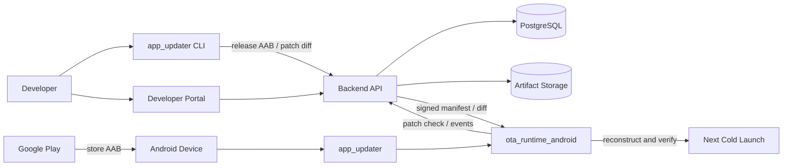

# App Updater

App Updater is a self-hosted OTA update system for shipping **Dart-only fixes** to Android Flutter
applications without changing the Google Play release.

The system stores the exact AAB submitted to the store as an immutable release base. For a later
fix, it builds a candidate AAB, verifies that only Dart AOT output changed, generates a compact
binary diff, signs the patch manifest, and activates the verified patch on the next cold launch.

> [!IMPORTANT]
> Native code, Flutter plugins, Android manifests, permissions, resources, assets, Flutter engine
> changes, and Dart SDK changes cannot be delivered as OTA patches. Publish a new Google Play
> release for those changes.

## Start here

The whole system has only three stages:

1. **Install one server.** It stores applications, releases, and patches.
2. **Connect each Flutter application once.** The CLI adds the updater and downloads its public
   configuration.
3. **Register every store release; publish patches when needed.** Each patch stays tied to the exact
   AAB uploaded to Google Play.

### First production setup

Follow these steps in order:

1. [Install the production server](docs/server_installation.md). The result is an HTTPS address such
   as `https://updates.example.com`. Flutter and Dart are not installed on the server.
2. Open that address, create a portal account, and then run
   `app_updater login --backend-url https://updates.example.com` on your development machine.
3. Open the Flutter project and [connect the application](#connect-a-flutter-application) with
   `app_updater init --create`.
4. Before sending a version to Google Play, run
   [`app_updater release android`](#publish-a-store-release) and upload the exact AAB it prints.
5. For a later Dart-only fix to that version, run
   [`app_updater patch android`](#publish-a-dart-only-patch).

Finally, use the [end-to-end walkthrough](#first-time-user-end-to-end-walkthrough) once with a test
application and device. After that, the normal workflow is only `release` for a new store version
and `patch` for a compatible Dart-only fix.

### Local trial instead

If you only want to try the system on one computer, skip production server installation and follow
the [short local setup](GETTING_STARTED.md).

## Contents

- [Start here](#start-here)
- [Supported scope](#supported-scope)
- [Architecture](#architecture)
- [Security and compatibility model](#security-and-compatibility-model)
- [Local development setup](#local-development-setup)
- [Connect a Flutter application](#connect-a-flutter-application)
- [First-time user end-to-end walkthrough](#first-time-user-end-to-end-walkthrough)
- [Publish a store release](#publish-a-store-release)
- [Publish a Dart-only patch](#publish-a-dart-only-patch)
- [Device lifecycle](#device-lifecycle)
- [Move to a new store version](#move-to-a-new-store-version)
- [Portal and authorization](#portal-and-authorization)
- [Production server installation](docs/server_installation.md)
- [Production checklist](#production-checklist)
- [Tests](#tests)
- [Troubleshooting](#troubleshooting)

## Supported scope

| Capability | Status |
|---|---|
| Android Dart-only OTA patches | Supported |
| Release-bound binary diffs | Supported |
| Managed RSA manifest signing | Supported |
| Signature, hash, and exact-build verification | Supported |
| Last-known-good and packaged-base fallback | Supported |
| Developer portal and per-app membership | Supported |
| Application logos | Supported |
| Windows, macOS, and Linux CLI | Supported |
| Native/plugin/resource/asset OTA changes | Not supported |
| iOS Dart code push | Out of scope |
| Percentage or staged rollout | Not implemented |
| Multiple production channels | Not implemented; `stable` is the default |

The CLI currently operates on one target ABI per command. Its default target is
`android-arm64` / `arm64-v8a`.

## Architecture

The repository contains five primary components:

| Component | Responsibility |
|---|---|
| [`app_updater/`](app_updater/) | Flutter-facing Dart API and Android plugin |
| [`app_updater_cli/`](app_updater_cli/) | Project setup, release registration, patch generation, and upload |
| [`backend/`](backend/) | Express API, developer portal, validation, and managed signing |
| [`ota_core/`](ota_core/) | Manifest, signing payload, and shared lifecycle contracts |
| [`ota_runtime_android/`](ota_runtime_android/) | Update check, verification, diff application, activation, and rollback |

PostgreSQL stores applications, memberships, releases, patches, keys, and device events. Artifact
storage holds immutable store AABs, patch diffs, and portal logo variants.



### Release flow

1. The CLI builds a release AAB.
2. It registers the AAB, Flutter engine revision, Dart version, ABI, protocol version, and packaged
   `libapp.so` hash.
3. The backend stores the artifact as the immutable base for that store version.
4. The developer uploads the **same AAB file printed by the CLI** to Google Play.

### Patch flow

1. The CLI downloads the registered store AAB.
2. It builds a candidate AAB from the current source.
3. It compares both archives and rejects changes outside the allowed Dart AOT output.
4. It creates a binary diff between the base and target `libapp.so`.
5. The backend validates the release identity, assigns the patch number, and signs the manifest
   with the application's managed key.
6. A device receives a patch only when its complete build identity matches.

## Security and compatibility model

### Exact-build identity

Every store base is bound to:

- OTA protocol version
- `versionName+versionCode`
- Flutter engine revision
- Dart SDK version
- ABI
- build mode
- packaged base `libapp.so` SHA-256
- a build fingerprint computed from those fields

The backend does not distribute a patch unless every field matches. The Android runtime repeats the
same checks independently before installation and again before boot.

### Managed signing

- Creating an application generates an app-specific RSA-3072 key pair.
- The public key is written to the application's `app_updater.yaml`.
- The private key is never sent to the developer.
- The backend encrypts the private key with AES-256-GCM under `SIGNING_MASTER_KEY`.
- Only manifests that pass backend validation are signed.

### Device-side safety

- Manifest schema, trusted key, revocation state, and signature are verified.
- The declared artifact size is enforced while downloading.
- The binary diff is applied to the `libapp.so` packaged in the installed store application.
- The reconstructed library must match the signed target SHA-256.
- Patch state and artifacts are written atomically.
- Failed patches are quarantined to prevent crash loops.
- Backend unavailability does not break application startup.
- Rollback occurs only after an explicit backend disable/revoke decision or a local boot failure.

Read [`docs/google_play_compliance.md`](docs/google_play_compliance.md) before production use.
App Updater is not a store-policy bypass mechanism. The publisher remains responsible for every
application and patch.

## Local development setup

### Prerequisites

- Docker and Docker Compose
- Flutter SDK
- Dart SDK
- Git
- Android SDK
- JDK, including `jar`

Verify the toolchain:

```bash
docker --version
docker compose version
flutter --version
dart --version
git --version
java -version
jar --version
flutter doctor
```

The normal CLI workflow runs on Windows, macOS, and Linux. Windows does not require WSL, Bash,
`curl`, `unzip`, or OpenSSL.

### 1. Start the backend

From the repository root:

```bash
docker compose up -d --build
```

Check the services:

```bash
docker compose ps
curl http://localhost:8081/healthz
```

Expected response:

```json
{"ok":true}
```

Docker Compose starts:

- PostgreSQL on host port `5432`;
- the backend on host port `8081`;
- a named volume for PostgreSQL data;
- a separate named volume for release, patch, and logo artifacts.

Pending numbered database migrations are applied automatically when the backend starts.

> [!WARNING]
> The Compose defaults for `ADMIN_API_KEY`, `SESSION_SECRET`, the PostgreSQL password, and
> `SIGNING_MASTER_KEY` are for local development only.

### 2. Create a portal account

Open:

```text
http://localhost:8081
```

Create a developer account from the `Register` page. Registration creates an identity but does not
grant access to any application. Application access is controlled by `app_members`.

### 3. Install the CLI

Run once:

```text
dart pub global activate --source git https://github.com/berkersaptas/app_updater.git --git-path app_updater_cli
```

Dart installs global executables into:

- macOS/Linux: `$HOME/.pub-cache/bin`
- Windows: `%LOCALAPPDATA%\Pub\Cache\bin`

For macOS with Zsh:

```bash
echo 'export PATH="$HOME/.pub-cache/bin:$PATH"' >> ~/.zshrc
source ~/.zshrc
```

Verify the installation:

```bash
app_updater --help
```

### 4. Log in from the CLI

```bash
app_updater login --backend-url http://localhost:8081
```

The CLI asks for the account email and password. A revocable 90-day token is stored with user-only
permissions at:

```text
~/.app_updater/credentials.json
```

Revoke the session and remove the local credentials with:

```bash
app_updater logout
```

## Connect a Flutter application

Open a terminal at the Flutter project root:

```bash
cd /path/to/flutter_app
```

### Create a new application

```bash
app_updater init \
  --create \
  --app-slug my-app-android \
  --package-name com.company.my_app
```

### Connect an application created in the portal

```bash
app_updater init --app-slug my-app-android
```

`init`:

- writes the public `app_updater.yaml` runtime configuration;
- adds the `app_updater` Flutter dependency;
- changes `MainActivity` to extend `FlutterOtaActivity`;
- adds `AppUpdater.instance.autoUpdate()` to a standard `lib/main.dart`;
- creates the owner membership and managed signer when `--create` is used;
- discovers and uploads the launcher icon for a newly created application when possible.

The command is idempotent. Rerunning it does not automatically overwrite an existing configuration
or portal logo.

Logo options:

```bash
# Explicitly upload or replace the logo
app_updater init --app-slug my-app-android --icon assets/icon/app.png

# Disable automatic logo discovery for a new application
app_updater init --create --app-slug my-app-android \
  --package-name com.company.my_app --skip-logo
```

Logos are profile assets, not release or patch metadata. The backend accepts PNG, JPEG, and WebP
files up to 2 MB with minimum dimensions of 128x128. It strips source metadata and creates normalized
WebP variants for the portal.

### Generated configuration

`app_updater.yaml` contains no private secret:

```yaml
app_slug: my-app-android
backend_url: https://updates.example.com
trusted_keys:
  - key_id: managed-rsa-20260827
    algorithm: rsa_pkcs1_sha256
    public_key: BASE64URL_PUBLIC_KEY
revoked_key_ids: []
```

Verify the first integration:

```bash
flutter pub get
flutter analyze
flutter build apk --debug
```

### Physical device with a local backend

If the generated backend URL is `http://localhost:8081`, forward the same device port to the host:

```bash
adb reverse tcp:8081 tcp:8081
```

The repository's `sample_app/app_updater.yaml` uses `localhost:8080`, so its forwarding command is:

```bash
adb reverse tcp:8080 tcp:8081
```

Production applications do not use `adb reverse`; `backend_url` must be an HTTPS address reachable
from the device.

## First-time user end-to-end walkthrough

This walkthrough is the acceptance path for a developer using App Updater for the first time. It
starts with an empty local service and ends with a verified patch activation and rollback on a real
device.

Use a disposable application slug and a non-production backend. For the closest production test,
use a Google Play Internal testing track and an HTTPS test backend. A USB-connected device with
`adb reverse` is also suitable for local development.

### Acceptance prerequisites

- An authorized Android device appears in `adb devices`.
- The device ABI matches the CLI target; the default is `arm64-v8a`.
- The Flutter SDK used by the application is pinned and available.
- The application has an obvious baseline marker such as `Version A` in its UI.
- The test backend may be reset without affecting other developers.

Keep a small acceptance record:

| Value | Example |
|---|---|
| App slug | `acceptance-app-android` |
| Package name | `com.company.acceptance_app` |
| Store version | `1.0.0+1` |
| Target ABI | `arm64-v8a` |
| Flutter version | Output of `flutter --version` |
| Baseline UI | `Version A` |
| Patched UI | `Version B` |

### Step 1: Start and verify the service

```bash
docker compose up -d --build
curl http://localhost:8081/healthz
```

Expected result:

```json
{"ok":true}
```

Open `http://localhost:8081`, register a test account, and confirm that the dashboard loads.

### Step 2: Install and authenticate the CLI

```bash
dart pub global activate --source git https://github.com/berkersaptas/app_updater.git --git-path app_updater_cli
app_updater login --backend-url http://localhost:8081
app_updater --help
```

Expected result: login succeeds and the CLI lists `init`, `release`, and `patch` commands.

### Step 3: Connect the Flutter project

From the application repository:

```bash
app_updater init \
  --create \
  --app-slug acceptance-app-android \
  --package-name com.company.acceptance_app

flutter pub get
flutter analyze
flutter build apk --debug
```

Verify these integration points before continuing:

- `app_updater.yaml` exists and contains the expected slug and backend URL.
- `pubspec.yaml` contains the `app_updater` dependency.
- `MainActivity` extends `FlutterOtaActivity`.
- `lib/main.dart` starts `AppUpdater.instance.autoUpdate()`.
- The portal shows the application and its logo or fallback mark.
- No private signing key exists in the application repository.

### Step 4: Register the store base

Set a new store version and keep the baseline UI visible:

```yaml
version: 1.0.0+1
```

```bash
app_updater release android --target-platform android-arm64
```

Expected result:

```text
Registered acceptance-app-android release 1.0.0+1 (arm64-v8a).
Upload this exact artifact to Play:
.../build/app/outputs/bundle/release/app-release.aab
```

Do not rebuild the AAB after this point. Upload the exact printed file to Google Play Internal
testing and install that release on the test device.

For a local backend configured as `http://localhost:8081`, keep the USB forwarding active:

```bash
adb reverse tcp:8081 tcp:8081
```

Launch the application and confirm that the UI displays `Version A`.

### Step 5: Publish a Dart-only patch

Change only Dart source so the UI displays `Version B`. Do not change the store version, Flutter
SDK, plugins, Android files, resources, or assets.

```bash
app_updater patch android --target-platform android-arm64
```

Expected result:

```text
Published acceptance-app-android 1.0.0+1 patch 1 (arm64-v8a).
```

The portal should now list patch `1` as enabled.

### Step 6: Verify staging and activation

Replace the package and activity below with the test application's values:

```bash
adb logcat -c
adb shell am force-stop com.company.acceptance_app
adb shell am start -W -n com.company.acceptance_app/.MainActivity
```

On this first launch after publishing:

- the UI should still display `Version A`;
- the update client should download, verify, and stage patch `1`;
- the currently running process must not change underneath the user.

Inspect relevant logs when needed:

```bash
adb logcat -d -s flutter:V OtaPatchLoader:V OtaUpdateClient:V
```

Perform another cold launch:

```bash
adb shell am force-stop com.company.acceptance_app
adb shell am start -W -n com.company.acceptance_app/.MainActivity
```

Expected result: the UI displays `Version B`, the signature and target hash are accepted, and the
runtime reports patch `1` as active. A third launch should report that no newer update is available.

### Step 7: Verify emergency rollback

Disable patch `1` from the portal. Then launch the application once so the active runtime receives
the rollback instruction. Perform one more cold launch.

Expected result:

- the running process is not terminated when rollback is received;
- patch `1` is not selected on the following boot;
- the application returns to the packaged `Version A` behavior;
- the application does not enter a restart or crash loop.

### Step 8: Verify negative paths

Run these checks only on the disposable acceptance application:

1. **Forbidden-change guard:** change an asset, Android resource, plugin, or native file and run
   `app_updater patch android`. The CLI must reject the patch and request a store release.
2. **Version isolation:** change `pubspec.yaml` to `1.1.0+2` without registering that release and
   run `patch android`. The command must fail because no matching store base exists.
3. **Backend outage:** stop only the local backend with `docker compose stop backend`, then cold
   launch the application. It must still boot from its verified local state. Restart the service
   with `docker compose start backend`.
4. **Unauthorized access:** invite a second account as `member`; it may view the logo and patch data
   but must not replace the application logo or manage membership.

### Acceptance completion criteria

- [ ] The exact registered AAB was installed from the test track.
- [ ] The baseline release launched successfully.
- [ ] A Dart-only patch was accepted and signed.
- [ ] The first launch staged the patch without changing the running process.
- [ ] The second cold launch activated the patch.
- [ ] A steady-state launch reported no update available.
- [ ] Disabling the patch returned the next boot to the packaged base.
- [ ] Native/resource/asset changes were rejected.
- [ ] Backend unavailability did not prevent application startup.
- [ ] A member could not perform owner-only operations.

### Repository maintainer automation

Maintainers can run the equivalent destructive acceptance environment against `sample_app`:

```bash
adb devices
./scripts/run_binary_diff_acceptance.sh
```

The script builds and installs a clean base APK, starts a fresh Docker backend, publishes a signed
binary diff, verifies staging and next-launch activation, and exercises incompatible-client and
failure paths.

> [!CAUTION]
> `run_binary_diff_acceptance.sh` resets Docker volumes and reinstalls the sample application. It is
> not a developer onboarding command and must never target shared or production infrastructure.

## Publish a store release

Set the Flutter version in `pubspec.yaml`:

```yaml
version: 1.0.0+1
```

Build and register the release:

```bash
app_updater release android
```

Select an ABI when necessary:

```bash
app_updater release android --target-platform android-arm64
```

The command:

1. builds the release AAB;
2. extracts the target ABI's `libapp.so`;
3. computes the exact-build fingerprint;
4. uploads the AAB and metadata to the backend;
5. prints the file that must be uploaded to Google Play.

Example:

```text
Registered my-app-android release 1.0.0+1 (arm64-v8a).
Upload this exact artifact to Play:
.../build/app/outputs/bundle/release/app-release.aab
```

**Upload exactly the AAB printed by the CLI.** Rebuilding the same commit does not guarantee a
byte-identical artifact.

## Publish a Dart-only patch

Fix the Dart code, but keep the existing `pubspec.yaml` version when targeting users of the current
store release:

```yaml
version: 1.0.0+1
```

Publish the patch:

```bash
app_updater patch android
```

The CLI:

1. downloads the registered store AAB for `1.0.0+1` and the target ABI;
2. builds a candidate AAB;
3. compares archive entries byte-for-byte;
4. creates a binary diff only when the change is within the allowed Dart AOT boundary;
5. uploads the diff and unsigned manifest metadata.

The backend:

1. validates release, engine, Dart version, ABI, base hash, and fingerprint;
2. assigns the next patch number;
3. signs the manifest with the managed signer;
4. publishes the patch.

A new store release is required if any of these changed:

- Android manifest or DEX
- Flutter plugins or native libraries
- Android resources
- Flutter assets
- Flutter engine
- Dart SDK
- ABI or build mode

## Device lifecycle

```text
Start with packaged store artifact
  -> backend patch check
  -> exact-build match
  -> manifest and signature verification
  -> binary diff download
  -> reconstruct from packaged store libapp.so
  -> target SHA-256 verification
  -> atomic staging as pending
  -> continue the current launch unchanged
  -> verify and activate on the next cold launch
```

A downloaded patch is never injected into the currently running process. It becomes active on the
**next cold launch**.

If activation fails:

1. the patch is marked failed/bad;
2. the same patch is not attempted again;
3. a verified last-known-good patch is selected;
4. if no safe patch exists, the runtime uses the artifact packaged in the APK/AAB.

When a patch is disabled in the portal, the backend returns an explicit rollback instruction. The
current process is not interrupted; the packaged base or another valid state is selected on the next
cold launch.

## Move to a new store version

Increment the Flutter version:

```yaml
version: 1.1.0+2
```

Register the new release:

```bash
app_updater release android
```

Release lines remain independent:

```text
1.0.0+1
  |-- patch 1
  `-- patch 2

1.1.0+2
  `-- no patches yet
```

Users who have not updated from Google Play remain on the `1.0.0+1` patch line. Users who install
the new store version move to `1.1.0+2`. A patch for the old release can never run on the new
release.

## Portal and authorization

The local portal is available at:

```text
http://localhost:8081
```

| Role | Permissions |
|---|---|
| Owner | Membership management, logo management, release and patch operations |
| Member | View the application and logo, perform patch operations |
| Root portal user | View the portal audit log |
| Operator API key | Cross-application management APIs |

The portal supports:

- application creation;
- owner/member invitations;
- application logo upload, replacement, and removal;
- patch visibility and emergency enable/disable;
- legacy publish-key creation;
- root-only admin audit visibility.

Applications without a logo receive a letter-based fallback mark. Members may view the logo, but
only owners may change it.

## Daily workflow

Once per development machine:

```bash
dart pub global activate --source git https://github.com/berkersaptas/app_updater.git --git-path app_updater_cli
app_updater login --backend-url https://updates.example.com
```

Once per Flutter project:

```bash
app_updater init --app-slug my-app-android
```

For every new Google Play version:

```bash
app_updater release android
```

For a Dart-only hotfix to that exact store version:

```bash
app_updater patch android
```

## Production checklist

Follow the complete [production server installation guide](docs/server_installation.md). The
provided Docker Compose configuration is intended for local development. Before production:

- [ ] Expose the backend only through HTTPS.
- [ ] Apply request-body and rate limits at the reverse proxy.
- [ ] Use durable, managed PostgreSQL with automated backups.
- [ ] Mount the artifact directory on durable, backed-up storage; introduce object storage/CDN support before horizontal scaling.
- [ ] Store a long random `SESSION_SECRET` in a secret manager.
- [ ] Use `ADMIN_API_KEY` only as a root operator-bootstrap credential.
- [ ] Store and back up an exactly 32-byte `SIGNING_MASTER_KEY` in a secret manager.
- [ ] Prefer KMS/HSM-backed private-key custody.
- [ ] Keep `ALLOW_FULL_AOT_LIBRARY=false`.
- [ ] Restrict portal registration through a reverse proxy, VPN, or corporate identity layer.
- [ ] Monitor device events, patch failures, and admin audit logs.
- [ ] Define signer rotation and emergency key-revocation procedures.
- [ ] Test database and artifact restoration regularly.
- [ ] Use a test-device or canary process because percentage rollout is not implemented yet.

Backend environment variables:

| Variable | Purpose |
|---|---|
| `DATABASE_URL` | PostgreSQL connection URL |
| `PORT` | Backend listening port |
| `ADMIN_API_KEY` | Root bootstrap key for operator management |
| `SESSION_SECRET` | Portal session-signing secret |
| `SIGNING_MASTER_KEY` | Managed private-key encryption key; exactly 32 bytes |
| `ARTIFACT_STORAGE_DIR` | Root directory for release, patch, and logo files |
| `ALLOW_FULL_AOT_LIBRARY` | Local proof-only escape hatch; keep `false` in production |
| `TRUST_PROXY` | Trust one directly connected reverse proxy; normally `true` behind production TLS termination |
| `SECURE_COOKIES` | Send portal session cookies only over HTTPS; use `true` in production |

## Tests

### Backend

```bash
cd backend
npm ci
npm test
```

### CLI

```bash
cd app_updater_cli
dart pub get
dart analyze
dart test
```

### Flutter plugin

```bash
cd app_updater
flutter pub get
flutter analyze
flutter test
```

### Android runtime

```bash
cd ota_runtime_android
./gradlew test
```

### Portal end-to-end test

```bash
./scripts/verify_portal.sh
```

> [!CAUTION]
> Some acceptance scripts run `docker compose down -v` to reset the backend. Never run them against
> a shared or production environment.

Real-device lifecycle test:

```bash
./scripts/run_device_acceptance.sh
```

Network binary-diff acceptance:

```bash
./scripts/run_binary_diff_acceptance.sh
```

Windows maintainer verification:

```powershell
.\scripts\verify_windows_cli.ps1
```

## Troubleshooting

### `app_updater: command not found`

Add the Dart global executable directory to `PATH`:

- macOS/Linux: `$HOME/.pub-cache/bin`
- Windows: `%LOCALAPPDATA%\Pub\Cache\bin`

### A physical device cannot reach the local backend

For a generated backend URL using `localhost:8081`:

```bash
adb reverse tcp:8081 tcp:8081
```

The URL visible from the device must match `backend_url` in `app_updater.yaml`.

### A patch is rejected

Common causes:

- `pubspec.yaml` no longer matches the store version;
- Flutter or Dart changed;
- a plugin, native file, resource, or asset changed;
- the wrong ABI was selected;
- Google Play received an AAB different from the registered artifact;
- `app_updater release android` was not run first.

Do not bypass these checks. The correct action is usually to publish a new store release.

### A patch was downloaded but is not visible

Patches are not injected into the current process. Fully stop and relaunch the application. The
patch activates on the next cold launch.

### What happens to users on an older store version?

Each store version has an independent patch line. Older users continue to receive eligible patches
for their installed release. A patch for a newer store build is never offered to them.

### Does the application start when the backend is unavailable?

Yes. A failed update check does not corrupt the current verified artifact and does not create an
automatic rollback. The application continues with its active patch or packaged store base.

## Repository layout

```text
app_updater/
  Flutter plugin and Dart API

app_updater_cli/
  Cross-platform release and patch CLI

backend/
  Express API, portal, migrations, and artifact management

ota_core/
  Manifest schema, signing payload, and lifecycle contracts

ota_runtime_android/
  Android patch runtime and update client

ota_runtime_ios/
  Inactive iOS contract skeleton

sample_app/
  Integration and device acceptance application

scripts/
  Build, verification, and acceptance tooling

docs/
  Architecture decisions, security, and production boundaries
```

## Additional documentation

- [`GETTING_STARTED.md`](GETTING_STARTED.md): short local setup
- [`app_updater/README.md`](app_updater/README.md): Flutter plugin API
- [`app_updater_cli/README.md`](app_updater_cli/README.md): CLI options
- [`backend/README.md`](backend/README.md): backend operation and endpoints
- [`docs/server_installation.md`](docs/server_installation.md): production server installation and operations
- [`docs/ota_architecture_principles.md`](docs/ota_architecture_principles.md): architecture principles
- [`docs/production_installer_contract.md`](docs/production_installer_contract.md): device/backend contract
- [`docs/google_play_compliance.md`](docs/google_play_compliance.md): Google Play boundaries
- [`docs/key_management.md`](docs/key_management.md): signing and key management
- [`docs/rollback_model.md`](docs/rollback_model.md): rollback and crash-loop protection

## License and operational responsibility

Before production use, independently review all third-party dependency licenses, organizational
security requirements, and store policies. The publisher is responsible for ensuring that every OTA
change remains consistent with the application's existing purpose and store listing.
