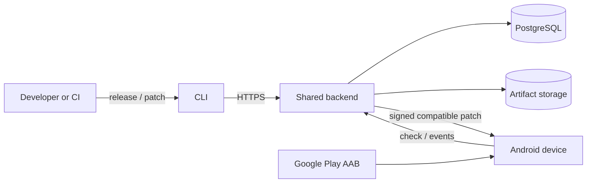

# App Updater

App Updater is a self-hosted update system for delivering **Dart-only fixes** to Android Flutter
applications. One centrally operated backend can serve many applications, teams, store versions,
and Flutter versions.

> [!IMPORTANT]
> An application developer normally does **not** install a server. Your platform/operations team
> installs one shared backend and gives developers its HTTPS URL. Developers only install the CLI
> and connect their Flutter projects.

## Choose your role

| You are... | What you need to do | Start here |
|---|---|---|
| An application developer | Connect a Flutter app to an existing backend, publish releases and patches | [Application onboarding](GETTING_STARTED.md) |
| A platform/server administrator | Install and operate one shared backend for your organization | [Server installation](docs/server_installation.md) |
| A repository contributor | Run the complete stack locally for development or testing | [Local development](docs/local_development.md) |

If your organization has already given you a URL such as `https://updates.example.com`, use the
**application developer** path. Do not run Docker or PostgreSQL on your computer.

## Application developer quick start

You need only:

- the shared backend HTTPS URL;
- a portal account or team invitation;
- your existing Flutter/Android development toolchain;
- the App Updater CLI.

### 1. Install the CLI once

```text
dart pub global activate --source git https://github.com/berkersaptas/app_updater.git --git-path app_updater_cli
```

Make sure Dart's global executable directory is on `PATH`, then verify:

```bash
app_updater --help
```

Detailed Windows, macOS, and Linux instructions are in
[Application onboarding](GETTING_STARTED.md#1-install-the-cli).

### 2. Sign in to the shared backend

Open the backend URL in a browser and create an account if registration is enabled. If your
organization controls registration, ask an application owner or platform administrator for access.

```bash
app_updater login --backend-url https://updates.example.com
```

### 3. Connect the Flutter application once

From the Flutter project root, create the application record:

```bash
app_updater init \
  --create \
  --app-slug my-app-android \
  --package-name com.company.my_app
```

If an owner already created the application and added you as a member:

```bash
app_updater init --app-slug my-app-android
```

`init` adds the Flutter dependency and Android runtime integration, creates `app_updater.yaml`, and
downloads only public runtime configuration. Private signing keys remain encrypted on the backend.

Verify the project after reviewing the generated changes:

```bash
flutter pub get
flutter analyze
flutter build apk --debug
```

### 4. Register every new Google Play release

Before submitting a new version to Google Play:

```bash
app_updater release android
```

Upload the **exact AAB printed by this command** to Google Play. The backend keeps that AAB as the
immutable base for patches targeting this store version.

### 5. Publish a Dart-only fix when needed

Keep the same store version, make the Dart-only change, and run:

```bash
app_updater patch android
```

The CLI downloads the registered base, builds a candidate with the application's own pinned Flutter
toolchain, rejects unsupported changes, creates the binary diff, and uploads it. A compatible device
downloads the patch in the background and activates it on the next cold launch.

That is the normal developer workflow:

```text
Once per machine:       login
Once per application:   init
Every store version:    release → upload that exact AAB to Google Play
For a Dart-only fix:    patch
```

Read the full [application onboarding guide](GETTING_STARTED.md) for account access, application
membership, CI use, device verification, and common mistakes.

## Who installs the server?

The backend is organization infrastructure, similar to a shared CI or artifact service:

```text
Platform team
    └── installs one backend per environment
            ├── Team A / Application A / multiple store versions
            ├── Team B / Application B / a different Flutter version
            └── Team C / Application C / multiple developers
```

The server does not build Flutter applications and does not need Flutter, Dart, Android SDK, Java,
or Xcode. Builds happen on developer or CI machines. The server stores release metadata and
artifacts, checks compatibility, manages signing, and serves devices.

Only the person responsible for shared infrastructure should follow the
[production server installation guide](docs/server_installation.md). It covers Docker Compose,
PostgreSQL, HTTPS, DNS, secrets, persistent artifact storage, backups, monitoring, upgrades, and
recovery.

Local `docker compose` is for repository development and isolated evaluation only. It is not a
required step for every application developer.

## Release and compatibility model

Every patch is tied to one exact store base using:

- application slug;
- platform and ABI;
- `versionName+versionCode`;
- Flutter engine revision and Dart SDK version;
- OTA protocol and build mode;
- packaged base `libapp.so` SHA-256;
- a fingerprint computed from the complete build identity.

This allows one backend to safely serve applications using different Flutter versions. Each
application is built by its own pinned toolchain, and a device receives only a patch matching its
installed store binary.

If a store AAB was uploaded without first running `app_updater release android`, do not attempt to
reconstruct its identity from another build. Publish and register a new store version.

## Supported changes

| Change | OTA patch? | Required action |
|---|---:|---|
| Dart implementation or UI logic compiled into `libapp.so` | Yes | `app_updater patch android` |
| Native Android/Kotlin/Java code | No | New Google Play release |
| Flutter plugin or dependency with native code | No | New Google Play release |
| Android manifest, permission, resource, or asset | No | New Google Play release |
| Flutter SDK, engine, or Dart SDK version | No | New Google Play release |
| Application version change | No | `app_updater release android`, then Google Play |
| iOS code push | No | Out of scope |

The current CLI targets one ABI per command and defaults to `android-arm64` / `arm64-v8a`.
Percentage rollout and multiple production channels are not currently implemented.

## Safety model

- The backend distributes a patch only when its full build identity matches.
- The Android runtime independently verifies compatibility, signature, size, and SHA-256.
- The binary diff is applied to the `libapp.so` packaged in the installed application.
- Patch state and files are written atomically.
- Failed patches are quarantined to prevent repeated crash loops.
- A last-known-good patch and the packaged store library remain available for fallback.
- Backend unavailability never prevents the packaged application from starting.
- Owners can disable a patch centrally for emergency rollback.

Read [Google Play compliance](docs/google_play_compliance.md) before production use. This system is
not a store-policy bypass; the publisher remains responsible for every application and patch.

## Architecture at a glance

| Component | Runs where | Responsibility |
|---|---|---|
| [`app_updater_cli/`](app_updater_cli/) | Developer/CI machine | Connects apps, builds releases, validates changes, creates and uploads patches |
| [`app_updater/`](app_updater/) | Flutter application | Public Dart API and Android plugin integration |
| [`ota_runtime_android/`](ota_runtime_android/) | Android device | Checks, verifies, reconstructs, activates, and rolls back patches |
| [`backend/`](backend/) | Shared server | Portal, API, PostgreSQL metadata, artifacts, validation, and managed signing |
| [`ota_core/`](ota_core/) | Shared library | Manifest, signature payload, and lifecycle contracts |



## Documentation

### Application developers

- [Application onboarding](GETTING_STARTED.md) — complete first-use and daily workflow
- [CLI reference](app_updater_cli/README.md) — commands and options
- [Flutter package reference](app_updater/README.md) — Dart and Android integration
- [End-to-end acceptance testing](docs/end_to_end_testing.md) — release, patch, activation, and negative paths
- [Google Play compliance](docs/google_play_compliance.md) — supported policy boundary

### Platform and security teams

- [Production server installation](docs/server_installation.md) — shared backend deployment and operation
- [Key management](docs/key_management.md) — signer custody, rotation, and revocation
- [Rollback model](docs/rollback_model.md) — disablement and device fallback
- [Backend reference](backend/README.md) — API, portal, authorization, and data model

### Repository contributors

- [Local development](docs/local_development.md) — local stack and test commands
- [Architecture principles](docs/ota_architecture_principles.md)
- [Android runtime contract](docs/production_installer_contract.md)
- [iOS runtime decision](docs/ios_runtime_decision.md)

## License and operational responsibility

No license file is currently included. Add an explicit license before distributing the repository.
Production operators are responsible for store-policy review, signing-key custody, access control,
backup restoration, monitoring, incident response, and validation on representative devices.
